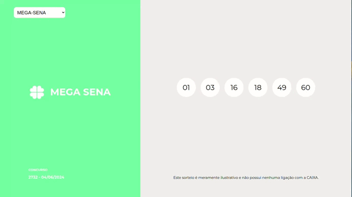

# Lorterias Front-end

This is my implementation for a frontend challenge where the goal was to build a user interface based on an API. The project uses React and Typescript to provide a responsive and dynamic experience.

## Showcase

### Desktop

### Mobile

## Links

[➤ Challenge](https://github.com/brainnco-exs/readme-frontend?tab=readme-ov-file)
[➤ Figma Template](https://www.figma.com/design/H2qrYBCFMf4didYmxRwTxP/Brainn-Frontend-Challenge?node-id=1-2&t=ytWXpCHH0ynZNf7f-0)
[➤ Deployment](https://megasena-frontend.vercel.app/)

## Tech Stack

- Typescript
- React
- Styled-Compents

## Process

For a detailed discussion on the original process and additional insights, refer to the [Dev_rocess](docs/Dev_process.md) file.

## Contributing

Contributions are welcome! Please fork the repository and use a feature branch. Pull requests are warmly welcome.

1. Fork the repository.
2. Create your feature branch (`git checkout -b feature/AmazingFeature`).
3. Commit your changes (`git commit -m 'Add some AmazingFeature'`).
4. Push to the branch (`git push origin feature/AmazingFeature`).
5. Open a Pull Request.

## License

This project is licensed under the [MIT License](LICENSE).

## Acknowledgments

I'd like to thank [Paulo](https://github.com/PauloHFS) for his valuable suggestion on approaching the project development process.

> [!WARNING]
> The API that the challenge indicated was no longer working, so I looked for one on my own and it presents a problem that blocks many requests in a short time through the CORS policy.
>
> The application works, but only some of the requests made. To make it work perfectly, I had to use a Google Chrome extension called [Allow CORS: Access-Control-Allow-Origin](https://chromewebstore.google.com/detail/allow-cors-access-control/lhobafahddgcelffkeicbaginigeejlf?hl=pt-BR) that can work around the problem.
